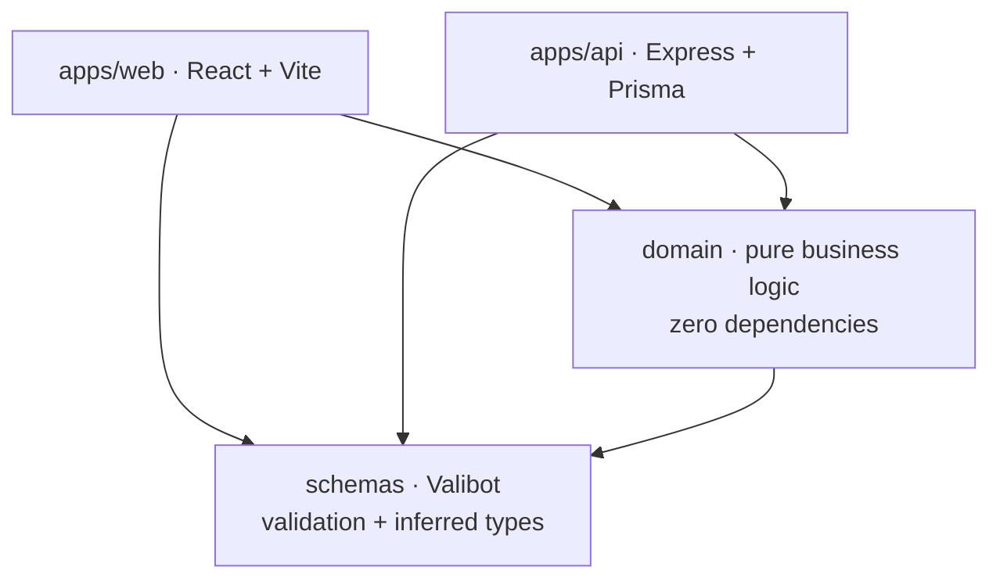

# Offer Calculator

[](https://github.com/michalik-maciej/offer-calculator/actions/workflows/ci.yml)

A quotation tool for retail shop fittings. You describe a store layout in terms of wall runs and
gondola units, and the app derives the bill of materials, groups it by component category and turns
it into a priced offer with a discount.

It is not a demo. It was built for a single real user, a shop-fitting designer who uses it to price
actual projects, and the domain model comes from how that work is really done rather than from an
invented example.

**Live:** https://projektownia.vercel.app · **Stack:** TypeScript everywhere, React + Express,
pnpm/Turborepo monorepo

> The hosted app sits behind a login, so the link above shows a sign-in form. To see the calculator
> itself, run it locally with the steps below.

<!-- TODO: screenshot of the offer editor goes here -->

## What it computes

A layout is not a list of parts. A wall run is a height, a depth and a set of shelf units, each with
its own width and shelf configuration; a gondola is the double-sided variant. Turning that into
something you can price means resolving how many uprights, feet, legs, back panels, base shelves and
regular shelves the configuration actually implies, at which widths, and then costing them against a
component inventory.

The `domain` package does exactly that and nothing else:

- `calculations/` — how many of one component a configuration needs
  (`calculateShelfDemand`, `calculateBackPanelDemand`, `calculateFootDemand`, `calculateLegDemand`,
  `calculateBaseShelfDemand`, `calculateBomPrice`)
- `transformations/` — pure mappings over a computed bill of materials
  (`breakdownDemandByCategory`, `countShelfUnitsByWidth`, `buildLayoutDescription`,
  `mapLayoutsToOfferOutput`)
- `orchestrations/` — compositions that produce a whole answer
  (`calculateWallLayoutDemand`, `calculateGondolaLayoutDemand`, `calculateOfferDemand`,
  `createOfferPreview`)
- `models/` and `fixtures/` — domain types, constraints and test data

## Architecture



Two decisions carry the whole design.

**The domain package has no dependencies.** Not "few" — none. It knows nothing about Express,
React, Prisma or HTTP. That is what made it survive three full rewrites of everything around it
(see [Project history](#project-history)), and it is why the pricing logic can be tested as plain
functions with no test harness, no mocking and no database.

**Validation schemas are shared between the front end and the back end.** Valibot schemas in
`schemas/` are the single definition of what an offer, a layout or an inventory component is. The
API validates requests against them, the React forms validate input against them, and both sides
derive their TypeScript types from the same source with `v.InferOutput`. A change to the shape of a
layout cannot drift between client and server, because there is only one shape.

## Tech stack

| Layer      | Choice                                                           |
| ---------- | ---------------------------------------------------------------- |
| Language   | TypeScript (composite project references)                        |
| Front end  | React 19, Vite, TanStack Router, TanStack Query, react-hook-form |
| UI         | Tailwind CSS v4, Radix UI primitives, class-variance-authority   |
| Back end   | Express, Prisma ORM                                              |
| Database   | PostgreSQL (Neon)                                                |
| Validation | Valibot, shared between client and server                        |
| Auth       | JWT, stateless, httpOnly cookies, bcrypt                         |
| Monorepo   | pnpm workspaces + Turborepo                                      |
| Tests      | Vitest                                                           |
| Quality    | ESLint 9, Prettier                                               |
| Hosting    | Vercel (web), Fly.io (API, Docker)                               |

The reasoning behind several of these is recorded in [`docs/decisions.md`](docs/decisions.md).

## Running locally

Requires Node 24+, pnpm 9+ and a PostgreSQL connection string.

```bash
pnpm install

# packages/apps/api/.env
#   DATABASE_URL=postgresql://...
#   JWT_SECRET=any-long-random-string
#   PORT=3000

pnpm --filter @senior-calculator/api exec prisma migrate deploy
pnpm --filter @senior-calculator/api exec prisma db seed

pnpm dev        # web on :5173, api on :3000
```

Other entry points: `pnpm dev:web`, `pnpm dev:api`, `pnpm build`.

## Tests and quality

```bash
pnpm test           # 26 tests across 15 files
pnpm test:coverage  # collected from the domain package
pnpm typecheck
pnpm lint
pnpm validate       # typecheck + lint + format check, everything at once
```

Tests concentrate on the domain package, where the logic that can actually be wrong lives, plus one
integration test that exercises the offer endpoint end to end. UI components are deliberately not
unit-tested: they are thin, and the interesting behaviour sits below them.

**The suite needs no database.** The preview endpoint receives its component inventory as an
injected dependency, wired in `createApp`, so the integration test builds an app around a fixture
catalogue and the whole suite runs offline in about a second. Every command above, and the CI
workflow, runs on a clean clone with nothing installed but dependencies.

## Project history

The same problem has been rebuilt four times as the requirements and my own tooling changed:

| Repository                | Period    | Approach                                        |
| ------------------------- | --------- | ----------------------------------------------- |
| `projektownia-kalkulator` | 2023–2024 | first working version                           |
| `next-calculator`         | 2024      | Next.js, Prisma, shadcn                         |
| `remix-calculator`        | 2024–2025 | Remix                                           |
| **`offer-calculator`**    | 2025–2026 | monorepo, isolated domain layer, shared schemas |

Each rewrite replaced the framework. None of them replaced the domain rules, which is the argument
for keeping those rules in a package that depends on nothing.

## Status

Feature-complete for its user's needs and in active use. Every push to `main` runs typecheck, lint,
formatting and the test suite (see the badge at the top). There is no public demo account yet, so
the live link shows a sign-in form; running it locally is the way to see the calculator itself.
